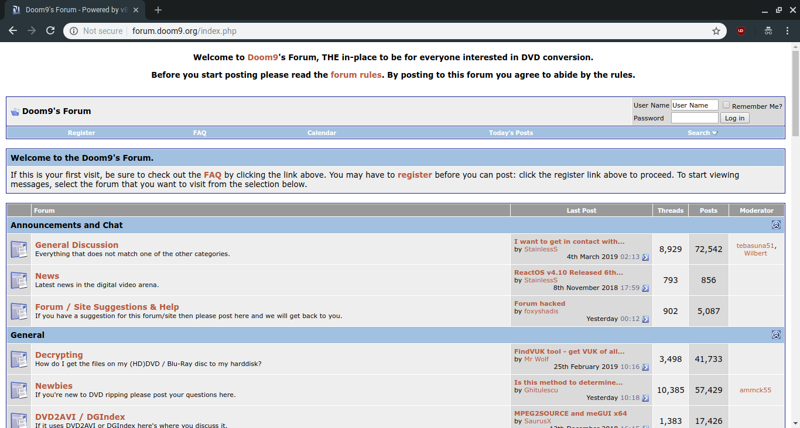
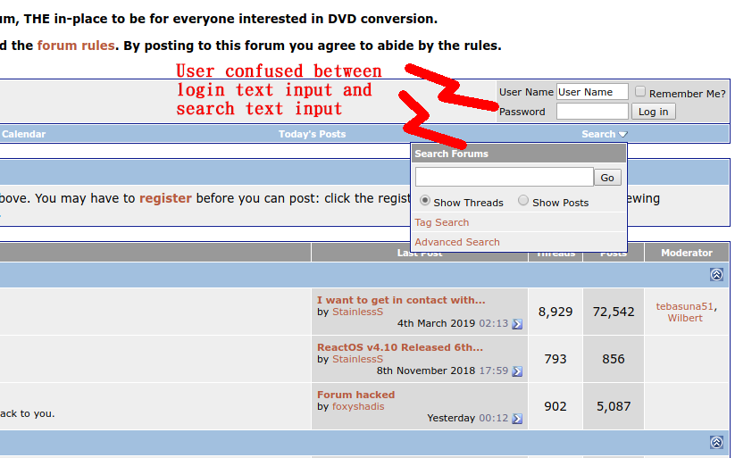
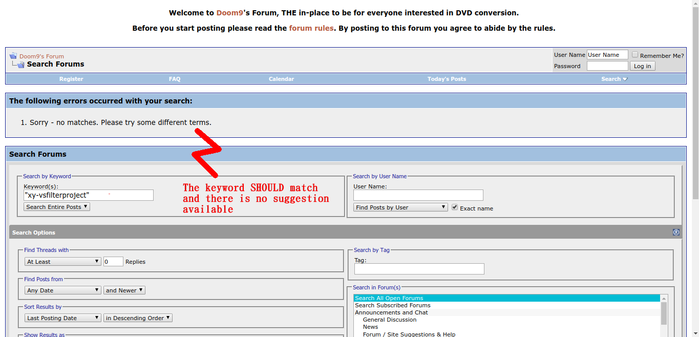
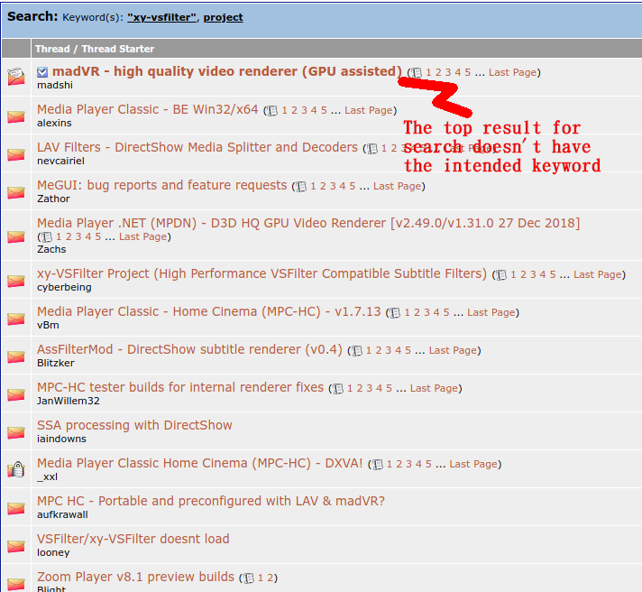
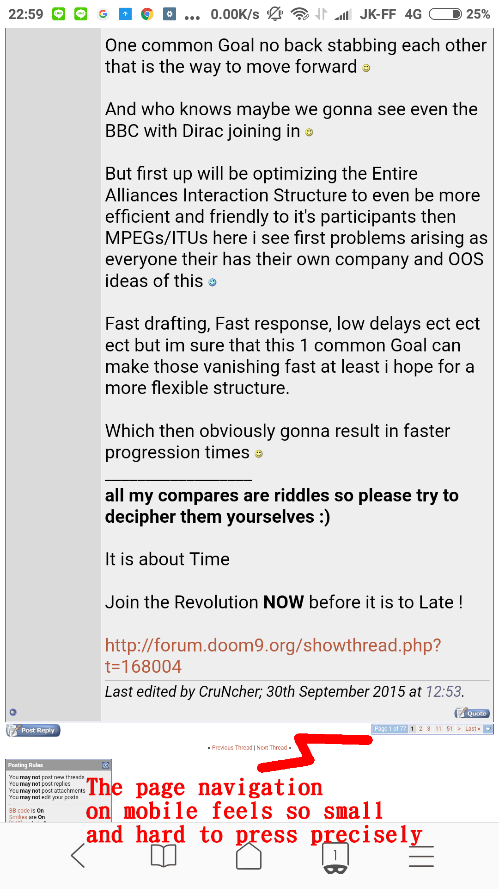
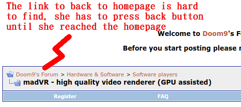
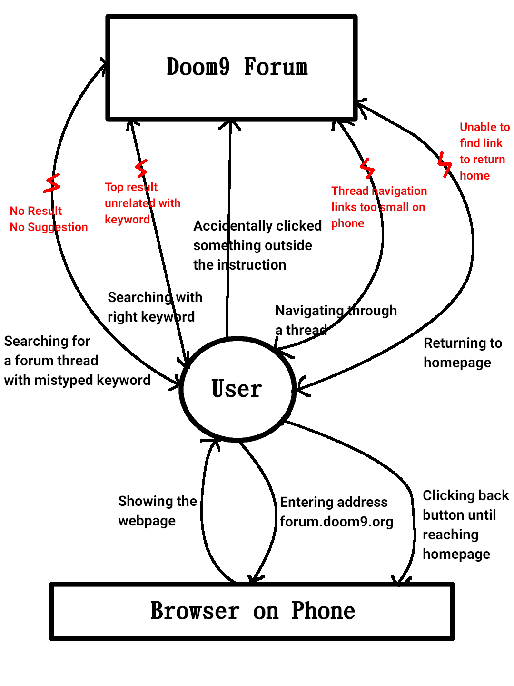
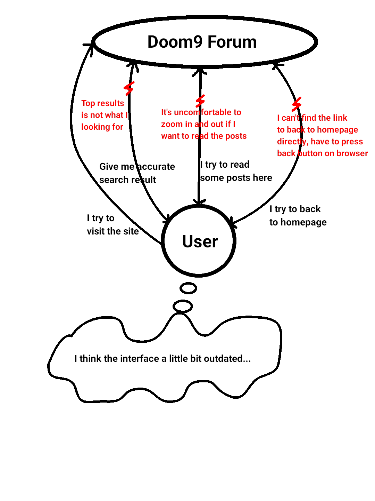

# Contextual Inquiry and Analysis
## Device/App/Website Description



Doom9 forum ([forum.doom9.org](https://forum.doom9.org)) is a forum site about Multimedia technology on PC, CD/DVD Ripping, Video/Audio codecs, Media Players etc. This site have some problem that make the site "not too friendly" for new users. For the example this site doesn't have "responsive design" or "mobile version" so you'll get the same view on phone like the desktop version, the unintuitive search feature and confusing menu placement.

## User Description
* She is a female user with age around 22 - 25 years old
* She has a little experience with working with forum sites before
* She has a little interest with any IT stuff
* She usually browse the internet with her tablet

## Instruction Script
I asked the respondent to do the following steps:

1. Visit forum.doom9.org using a phone browser
2. Search a forum thread with title containing `xy-VSFilter Project`
3. Enter one of forum thread, try to read something there, then try to navigate between pages
4. Back to the homepage

## Transcript

I just put the significant ones to the transcript. If I put the whole recording into transcript it would consume a lot of time and space.

Here is the transcript

```
00:00:00,000 --> 00:03:53,350 | Me, Respondent
<<Just some introduction to a topic. It's too many if I put all here>>

00:03:53,350 --> 00:04:13,700 | Me
Tugasnya adalah coba kunjungi forum.doom9.org

00:04:21,600 --> 00:04:22,550 | Respondent
Forum ya?

00:04:22,550 --> 00:04:32,700 | Me
Ya, forum.doom9.org. Nah itu yang mau diujicobakan

00:04:32,700 --> 00:05:34,300 | Me
<<Introducing the overview about the site>>

00:05:34,300 --> 00:06:21,600 | Me
Setelah itu saya minta mbak buat search.... Forum dengan judul.... Tulis mirip seperti ini: xy-VSFilter Project

00:06:25,350 --> 00:06:26,750 | Respondent
xy ya?

00:06:26,750 --> 00:06:31,050 | Me
xy... Pokoknya mirip ini ya

00:06:45,950 --> 00:06:49,550 | Me
Apakah muncul hasil?

00:06:52,550 --> 00:06:55,600 | Respondent
Kyk gini ya? Apa bukan?

00:06:55,600 --> 00:07:07,700 | Me
Bukan mbak, masalahnya di bawah kalau nggak salah itu ada tulisan not found

00:07:07,700 --> 00:07:10,000 | Respondent
Sorry no match ini ya?

00:07:10,100 --> 00:07:21,400 | Me
Ya, ini. Sorry no match itu artinya tidak ditemukan. Berarti bukan salah... Berarti memang fitur pencariannya agak 
kurang peka

00:07:21,400 --> 00:07:22,850 | Respondent
Oh gitu...

00:07:22,850 --> 00:07:29,550 | Me
Salah satu masalahnya berarti fitur pencariannya memang agak kurang... peka

00:07:32,850 --> 00:07:46,600 | Me
Coba kalau misalkan... Udah sama persis besar kecilnya keyword yang dimasukkan? Besar kecilnya terus spasinya juga 
udah sama kah?

00:08:19,250 --> 00:08:22,300 | Me
Ya, seperti itu. Silakan disearch

00:08:22,300 --> 00:08:29,850 | Me
Keluarkah hasil yang judulnya awalnya mirip seperti ini?

00:08:34,900 --> 00:08:37,850 | Me
Coba dari hasil itu apakah ada yang keluar...

00:08:38,850 --> 00:08:45,600 | Respondent
Ada... Eh tapi doesn't load. Ini ada

00:08:45,600 --> 00:08:50,400 | Me
Yang mana? Coba ke bawah, hasil nomor...

00:08:50,400 --> 00:08:52,850 | Respondent
Nomor kedua dari bawah

00:08:52,850 --> 00:08:59,550 | Me
Dua dari bawah? Seharusnya yang paling mirip yang paling atas ya?

00:08:59,550 --> 00:09:00,500 | Respondent
Iya...

00:09:00,500 --> 00:09:08,950 | Me
Iya harusnya yang paling mirip yang paling atas. Jadi itu.... Masalah lagi

00:09:32,700 --> 00:09:40,000 | Me
Nah, coba mbaknya saya minta tolong buka link yang pertama

00:09:46,550 --> 00:09:51,400 | Me
Coba dilihat itu halaman berapa... Mungkin mbaknya salah klik

00:10:01,700 --> 00:10:08,150 | Me
Kalau dari pengalamannya mbak membaca forum seperti ini nyaman nggak?

00:10:08,200 --> 00:10:09,200 | Respondent
Nggak

00:10:09,200 --> 00:10:12,100 | Me
Nggak nyamannya kyk gimana? Ceritakan aja

00:10:12,100 --> 00:10:15,200 | Respondent
Ya pusing aja... Apa yang mau dibaca coba?

00:10:15,200 --> 00:10:27,200 | Me
Ya maksudnya anggap aja ada konten sembarang. Itu misalkan lihat dengan interface kyk gini mbaknya nyaman nggak?

00:10:27,200 --> 00:10:28,500 | Respondent
Nggak, nggak nyaman

00:10:28,500 --> 00:10:29,850 | Me
Nggak nyamannya kyk gimana?

00:10:29,850 --> 00:10:51,250 | Respondent
Dia kan handphone jadi kan harus di zoom gitu buat baca itu. Biasanya kalau baca di handphone kalau tampilannya
handphone kita kan tinggak scrolling aja nggak perlu di zoom gitu. Kalau ini kan harus di zoom terus kalau mau
baca ujungnya harus digeser lagi

00:10:58,600 --> 00:11:04,900 | Me
Coba mbak kira-kira kalau mau ganti ke page lain. Mbaknya nyaman nggak kira-kira?

00:11:13,750 --> 00:11:25,250 | Respondent
Ini link 2... Ini link 3... Ini link 4... Langsung scrolling ke bawah gini kan? Oh... ini ini.... Iya ya,
tampilannya kyk komputer banget ya dia...

00:11:25,250 --> 00:11:29,550 | Me
Ya mbak, jadi menurut mbak gimana?

00:11:29,550 --> 00:11:38,000 | Respondent
Nggak nyaman sih... Jadi harusnya kyk semisal bisa di swipe-up atau digeser-geser gitu aja tapi ini gabisa

00:11:38,000 --> 00:11:49,850 | Me
Ya jadi memang kelemahannya website yang... Terutama forum yang nggak mempunyai tampilan khusus buat
handphone memang kyk gitu mbak, salah satunya

00:11:54,450 --> 00:12:03,700 | Me
Selain itu mungkin mbaknya punya ketidaknyamanan lain? Jadi kita nggak ngomongin tentang kontennya ya mbak
soalnya kontennya bukan makanan mbak.

00:12:03,700 --> 00:12:05,100 | Respondent
Kaku sih...

00:12:05,100 --> 00:12:06,500 | Me
Kakunya di sebelah mana?

00:12:06,500 --> 00:12:33,350 | Respondent
Kyk apa ya... Kyk nggak nyaman aja bacanya kyk membosankan banget gitu lo dan ini kyk tampilan lama
banget. Sedangkan kalau misal kita search di google kan, itu jauh lebih menarik kyk semisal simple banget kalau
kita pengen cari gambar kyk gitu terus kita tinggal klik bagian gambar atau web atau book atau gimana itu
kan lebih simple sedangkan kalau di sini kan kyk kotak-kotak kyk... Apa itu namanya aku nggak ngerti

00:12:33,350 --> 00:12:39,400 | Me
Oh ya berarti kalau bisa disimpulkan tampilannya kurang menarik gitu

00:12:39,400 --> 00:12:41,100 | Respondent
Iya, kurang menarik

00:12:41,100 --> 00:13:24,950 | Me
<<Explaining about the target audience of this forum>>

00:13:24,950 --> 00:13:45,500 | Respondent
Aku bingung aja sih... Maksudnya ini berarti... Apa ya? Kyk ya itu tadi sih tampilannya terus kemudian buat ke
halaman yang selanjutnya itu harus zoom lagi terus kalau misalkan mau baca terus tulisannya nggak kebaca
harus zoom lagi kyk gitu.

00:14:03,150 --> 00:14:17,450 | Me
Coba mbaknya... Ya explore sembarang lah. Mungkin gimana kembali ke home, terus buka...

00:14:17,450 --> 00:14:30,150 | Respondent
Ini juga searchnya juga kyk gini maksudnya kyk letaknya di pojok banget gitu lo. Aku pikir ini tempatnya
password ini adalah tempatnya search. Tapi kita harus ngeklik dulu biar dia keluar kyk gini...

00:14:30,150 --> 00:14:31,650 | Me
Agak membingungkan buat...

00:14:31,650 --> 00:14:42,050 | Respondent
Ya, agak membingungkan. Harapannya kan dia bisa kyk keluar tinggal kolom hp terus kita search aja kan...
Aku sempet bingung sih cari searchnya di mana.

00:14:42,050 --> 00:14:47,400 | Me
Ya bererti antara kolom search sama kolom login password agak membingungkan?

00:14:47,400 --> 00:14:52,150 | Respondent
Ya... Betul... Terus... Ini aku search apa ya enaknya ya?

00:14:52,150 --> 00:14:54,950 | Me
Bukan search sih... Balik ke home...

00:14:54,950 --> 00:14:56,400 | Respondent
Oh.. Balik ke home...

00:14:56,400 --> 00:14:59,300 | Me
Coba cari cara untuk balik ke home.

00:15:11,650 --> 00:15:13,300 | Respondent
Register... Bukan ya?

00:15:13,300 --> 00:15:17,200 | Me
Bukan, kalau register kan daftar sebagai user baru.

00:15:23,300 --> 00:15:26,050 | Respondent
Ya... Di-back aja kyknya...

00:15:45,300 --> 00:15:47,750 | Respondent
Ini ya? Ini home udah?

00:15:47,750 --> 00:15:59,500 | Me
Bukan, itu bukan homepage. Homepage itu yang tadi ada.... Banyak banyak itu... Ya tampilannya kurang
lebih seperti....

00:15:59,500 --> 00:16:00,850 | Respondent
Ini ya? Ini ya?

00:16:00,850 --> 00:16:01,650 | Me
Ya, yang itu

00:16:01,650 --> 00:16:07,600 | Respondent
Oke... Harus di back ya? Gaada tanda homenya? Gabisa langsung lompat ya?

00:16:08,400 --> 00:16:14,250 | Me
Harusnya ada sih... Cuman mungkin mbaknya kurang tahu tempatnya

00:16:14,260 --> 00:16:16,850 | Respondent
Oke.... Tempatnya ada di mana kah?

00:16:16,860 --> 00:16:18,850 | Me
Coba kembali ke bagian yang tadi...

00:16:31,050 --> 00:16:37,450 | Me
Sebenarnya nggak terlalu kelihatan sih... Namanya bukan home juga... Ini...

00:16:37,450 --> 00:16:39,000 | Respondent
Apa?

00:16:39,000 --> 00:16:40,950 | Me
Yang ini yang "Doom9's Forum" ini

00:16:40,950 --> 00:16:45,850 | Respondent
Oh... Yayaya... Jadi awal yang kita cari ya?

00:16:45,850 --> 00:16:48,200 | Me
Maksudnya home itu ya... Itu mbak

00:16:48,200 --> 00:17:03,150 | Me, Respondent
<<Talking about homepage>>

00:17:03,150 --> 00:17:15,500 | Me
Tadi mbaknya kembali ke homenya pakai cara back ya? Ok, jadi cara aslinya itu seperti itu. Bagaimana
komentarnya mbak?

00:17:15,500 --> 00:17:34,500 | Respondent
Ya... Biasanya home kan identik dengan gambar rumah ya? Biasanya langsung klik rumah balik udah di awal. cuman
tadi aku nggak ngerti aja kok ada folder membuka kyk gitu terus eh habis itu ternyata itu. Berarti nama yang
pertama kita search itu yang jadi home

00:17:34,500 --> 00:19:15,200 | Me, Respondent
<<Just a resume about the interview>>
```

The original recording is available [here](https://raw.githubusercontent.com/hci-a-if-its-2019/assignment-1-ojoakua-10bit/master/audio/interview.mp3)

## Models and Annotations
### Artifact Model






### Flow Model


### Cultural Model


## Do's and Don't's

* Give a separate mobile sites or at least make your site responsive. It's awful if we have to zoom in and out just to read the content.
* Don't hide the vital function of site (like search). It might confuse the users.
* Make the top search result is the most relevant to the entered keyword. Rather than the most popular but less relevant.
* If there is no match result for the entered keyword, show the closest suggestion if possible. It's possible that users made a typological error when entering the keyword.

# Remarks
> * Thanks for completing all the parts in this assignment.
> * However, the `Models and Annotations` lack of reference numbers (with which time-codes on the `Transcript` the breakdowns/barriers relate to). The reference numbers are necessary to underlines that all the problems you have exposed on the Models have evidences.

| Working Days | Commits before D | Commits after D | Presentation (80%) | Repo (20%) | Total |
|:------------:|:----------------:|:---------------:|:------------------:|:----------:|:-----:|
| 2            | 2                | 6               | 87                 | 62,5       | 82,1  |
